# Football Shirt Emporium

Retro football shirts for collectors and fans.  
Clean user experience, secure checkout, and a fully responsive layout (including an additional ≤ 300 px breakpoint).

**Live Site:**  
https://footballshirt-emporium-05431c39ab7e.herokuapp.com/


## Contents

- [Purpose & Rationale](#purpose--rationale)  
- [User Experience (UX)](#user-experience-ux)  
- [Design](#design)  
- [Features](#features)  
- [Information Architecture & Data Model](#information-architecture--data-model)  
- [Technology Stack](#technology-stack)  
- [Payments & Webhooks](#payments--webhooks)  
- [Background Tasks (Celery)](#background-tasks-celery)  
- [Testing](#testing)  
- [Deployment](#deployment)  
- [Version Control & Development Process](#version-control--development-process)  
- [Accessibility](#accessibility)  
- [Security Notes](#security-notes)  
- [Known Issues & Future Enhancements](#known-issues--future-enhancements)  
- [Credits](#credits)  
- [Licence](#licence)


## Purpose & Rationale

Football Shirt Emporium is a **full-stack e-commerce web application** built with **Django 5**, designed to provide a nostalgic yet modern experience for browsing and purchasing **retro football shirts**. The project combines professional-grade functionality with strong UX and accessibility principles, demonstrating a comprehensive understanding of full-stack development, database integration, secure payments, and responsive design.

### Real-World Context

The popularity of vintage and retro football culture has grown significantly in recent years. Many fans and collectors seek classic kits that represent key moments in football history, yet existing online options are often fragmented across social media resellers, forums, and unverified marketplaces. These environments lack **trust, consistent quality control, and accessible user experiences** — particularly on mobile devices.

Football Shirt Emporium addresses this problem by providing a **centralised, user-friendly platform** where collectors and fans can securely browse, purchase, and manage retro football shirts through a fully functional online store.

### Project Purpose

The purpose of the project is to demonstrate a fully functioning, real-world e-commerce solution that:
- Provides a **trustworthy, visually engaging, and responsive shopping experience**.
- Enables **secure online transactions** through Stripe Checkout and verified webhook events.
- Supports **user authentication and personalised data**, such as saved addresses and order history.
- Demonstrates a professional approach to **UX, accessibility, testing, and deployment**.


### Target Audience

- **Football enthusiasts** For people of all ages interested in classic kits, nostalgia, and memorabilia.  
- **Collectors and hobbyists** seeking a reliable and organised way to browse or purchase vintage shirts.  
- **Casual users** looking for unique, design-led gifts or retro fashion items.

### Technical & Design Rationale

- **Django 5** was selected as the framework for its strong MVC architecture, built-in authentication, and ORM, which allow clean separation of concerns and secure database handling.  
- **Stripe** was integrated for its trusted, developer-friendly API and full PCI compliance, ensuring payment security.  
- **PostgreSQL** provides scalable relational data storage, supporting complex model relationships between products, orders, and users.  
- A **custom CSS grid system** ensures lightweight performance and pixel-perfect control, including an additional ≤300 px breakpoint to support ultra-small devices.  
- **Roboto** was chosen for its modern, versatile readability, complementing the site’s minimalist aesthetic.

### Educational & Professional Value

The project demonstrates the full life cycle of web application development — from ideation and design to testing and deployment — while applying principles of **user experience, accessibility, security, and scalability**.  
It showcases technical proficiency in:
- Django model design and CRUD operations.  
- Template and view logic separation following MVC conventions.  
- Secure payment integration via webhooks.  
- Asynchronous task management using Celery.  
- Version control and documentation best practices.


### Objectives

- Deliver a realistic online store for retro and classic kits.  
- Provide secure, reliable Stripe Checkout payments.  
- Allow users to register, manage addresses, and review orders.  
- Demonstrate a production-grade Django MVC architecture with payment logic.


### Value Proposition

A nostalgic, football-focused e-commerce experience built with modern technology — combining strong UX, responsive design, and secure payments.


## User Experience (UX)

### Project Goals

- Intuitive browsing experience with clear product visuals.  
- Low-friction checkout and transparent feedback.  
- Responsive layout with accessibility and performance in mind.

### User Stories

**Visitor**  
- Understand the purpose of the site immediately.  
- Browse categories, view product details, and add to cart.  
- See live cart summary and totals.

**Registered User**  
- Register and log in/out securely.  
- Manage profile and saved addresses.  
- View and track past orders.

**Administrator**  
- Manage products and orders through Django Admin.  
- Optionally export orders as PDFs (WeasyPrint).


### Information Hierarchy & Navigation

- Fixed header with brand logo and navigation: *Home, Shop, Cart, Account*.  
- Homepage hero section summarises brand purpose and linking to the shop.  
- Product categories organised by team, decade, and brand.  
- Consistent structure and breadcrumb navigation.


## Design

### Branding, Colour & Typography

| Element | Details |
|----------|----------|
| **Font** | Roboto (sans-serif, modern, readable) |
| **Primary Colour** | White `#FDFDFD` |
| **Accent Colour** | Black `#000000` |
| **Highlight** | Hookers green `#496D5F` |
| **Neutral Shades** | Brunswick green `#385D4E`, Hookers green `#496D5F`  |

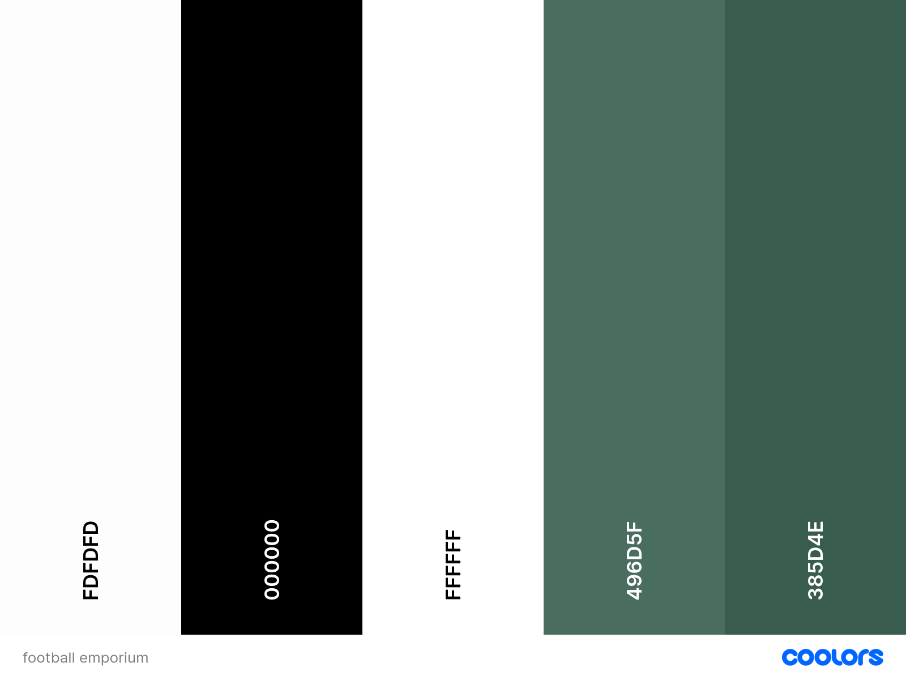

The design blends a modern UI aesthetic with retro football nostalgia.  
Typography and spacing reinforce readability and clarity.


### Wireframes & Layout

- **Home:** Hero banner, featured products, call to action.  
- **Shop:** Responsive grid of product cards with filters.  
- **Product Detail:** Large image, description, price, and Add to Cart.  
- **Cart/Checkout:** Step-by-step process with validation and feedback.  
- **Dashboard:** Displays user profile, orders, and saved addresses.  
- **Footer:** Simple layout with quick links and social icons.
The wireframes evolved throughout development as additional features were introduced to meet higher assessment criteria. As a result, elements such as a search bar and a dedicated “My Account” section were added to enhance usability and functionality.


### Accessibility

- Semantic HTML and proper heading structure.  
- ARIA labels for form fields and interactive elements.  
- WCAG 2.1 AA colour contrast compliance.  
- Keyboard-navigable forms and modals.  
- Skip-link and visible focus states.

## Features

- Product catalogue with categories and detailed pages.  
- Session-based shopping cart (add, update, remove).  
- Stripe Checkout with success and cancel pages.  
- Webhooks update order status and store `stripe_id`.  
- Guest checkout.
- User authentication and dashboard.  
- Address management (CRUD + default).  
- Responsive grid layout including ≤ 300 px screens.  
- Logging and graceful error handling.  
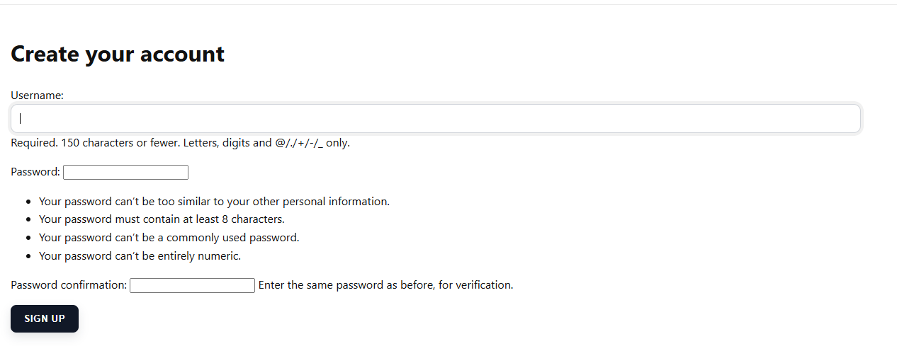 

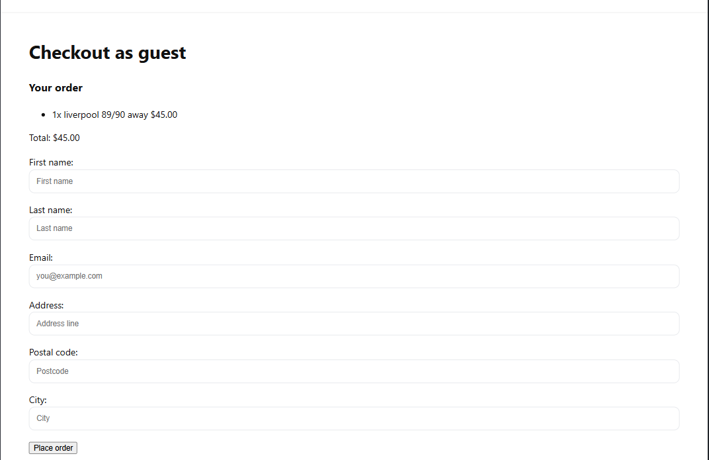


## Information Architecture & Data Model

### Applications

## Django Apps Overview

| App | Models (core) | What it does |
|-----|---------------|--------------|
| **shop** | `Category`, `Product` | Product catalogue (browse by category, product detail pages, images, prices, availability). |
| **cart** | *(session-based, no DB model required)* | Shopping cart stored in the user’s session (add/update/remove items; persists until checkout). |
| **orders** | `Order`, `OrderItem` | Captures customer orders from the cart; stores totals, status, and line items for each product purchased. |
| **payment** | `Payment` *(or gateway-specific fields)* | Handles checkout payment flow (create payment intent/charge, confirm, record success/failure, webhook handling if used). |
| **addresses** | `Address` | Saved delivery/billing addresses linked to users; selectable during checkout. |
| **accounts** | *(uses Django `User`)* + optional `Profile` | Registration/login/logout, “My account” area, optional profile fields; integrates with password validation policy. |

### Third-party / Platform Integrations
- **cloudinary / cloudinary_storage** – Media storage/CDN for product images and other uploads.
- **django.contrib.\*** – Admin, auth, sessions, messages, static files, etc.

### How they fit together
1. **shop** – User browses products → product detail page.
2. **cart** – Adds items; cart state stored in session.
3. **addresses** – User selects/saves delivery/billing address at checkout.
4. **orders** – Order + line items created from cart contents.
5. **payment** – User pays → success/failure recorded against the order.
6. **accounts** – Auth (login/register), “My account” page, order history links.

### Key URLs 
- `shop/` → product list, category filter, product detail
- `cart/` → cart detail, add, remove, update quantity
- `orders/` → create order, order confirmation
- `payment/` → payment processing routes (success, failure, webhooks)
- `accounts/` → register, login, logout, account dashboard
- `addresses/` → add/edit/delete address, choose for checkout

### Notes
- The **cart** is session-based (no DB table required), which keeps it fast and simple.
- **Payment** app can be wired to Stripe/PayPal/etc.; store minimal data needed to reconcile payments (status, reference/intent ID).
- **Password security** uses Django’s validators (min length, common password checks, etc.); see the “Authentication & Password Security” section for details.


### Relationships

- Category → Products: One-to-Many  
- Order → OrderItems: One-to-Many  
- User → Addresses: One-to-Many  

### Schema Overview

| Model | Key Fields |
|--------|------------|
| Category | name, slug |
| Product | category FK, name, image, price, available |
| Order | user FK, email, paid, stripe_id, created |
| OrderItem | order FK, product FK, price, quantity |
| Address | user FK, city, postal_code, is_default |

Each model supports full CRUD operations with validation.

### Data Models
Two core Django models drive the store’s functionality:
- **Product:** Defines name, price, image, and stock.
- **Order:** Stores customer information and line items.
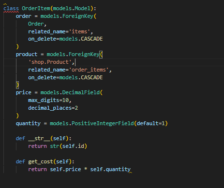 
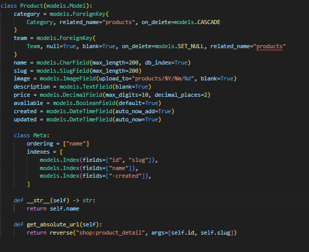

## Technology Stack

| Layer | Technology |
|-------|-------------|
| **Backend** | Django 5, Python 3.12 |
| **Frontend** | HTML / CSS (custom grid, Roboto font) |
| **Database** | PostgreSQL |
| **Payments** | Stripe Checkout + Webhooks |
| **Async Tasks** | Celery (Redis / RabbitMQ) |
| **Hosting** | Heroku |
| **Static Files** | WhiteNoise |
| **Environment Management** | python-decouple + `.env` |
| **Version Control** | Git + GitHub |
| **Product images** | Cloudiary |


## Payments & Webhooks

1. Checkout session created from cart items (GBP).  
2. User redirected to hosted Stripe Checkout page.  
3. Webhook (`/payment/webhook/`) verifies signature and updates `Order.paid`.  
4. Celery triggers post-payment fulfilment tasks.

**Local Testing Example**

```bash
stripe login
stripe listen --forward-to http://localhost:8000/payment/webhook/ --print-secret
stripe trigger checkout.session.completed
```


## Background Tasks (Celery)

Used for asynchronous operations such as order confirmation emails.

```python
@shared_task
def send_order_confirmation(order_id):
    order = Order.objects.get(id=order_id)
    send_mail(
        "Order Confirmed",
        f"Thanks, {order.first_name}! Your order is confirmed.",
        "noreply@emporium.com",
        [order.email],
    )
```

configured via `CELERY_BROKER_URL` environment variable


## Testing

The testing phase was designed to ensure that **Football Shirt Emporium** performs reliably across devices, browsers, and user interactions whilst maintaining data integrity, accessibility, and a smooth user experience.  
Testing was approached using a **hybrid strategy** that combined automated unit testing, manual exploratory testing, and accessibility evaluation.  
The testing process followed a **Test-Driven Development (TDD)** approach where appropriate, in line with professional Django development practices.

### Testing Objectives

- Validate that all models, views, forms, and templates function as intended.  
- Confirm that user interactions (cart updates, payments, and authentication) behave correctly.  
- Ensure data validation, security, and error handling across the system.  
- Verify responsiveness and accessibility across a range of devices and screen sizes.  
- Demonstrate test coverage evidence and compliance with Django framework conventions.


### Automated Testing

Automated tests were implemented using **Django’s built-in TestCase framework**, covering core features at the model, view, and form level.  
The aim was to confirm **functional correctness, integrity of relationships**, and **expected data outcomes** following CRUD operations.

**Key Areas Covered:**
- **Models:** Verifies model creation, string representations, and foreign key relationships.  
- **Views:** Ensures HTTP responses render correct templates and redirect logic (for example, after checkout).  
- **Forms:** Tests form validation rules and field-level error messaging.  
- **Webhooks:** Simulates Stripe webhook events to verify order updates and signature validation.

**Example Automated Test Snippet:**
python
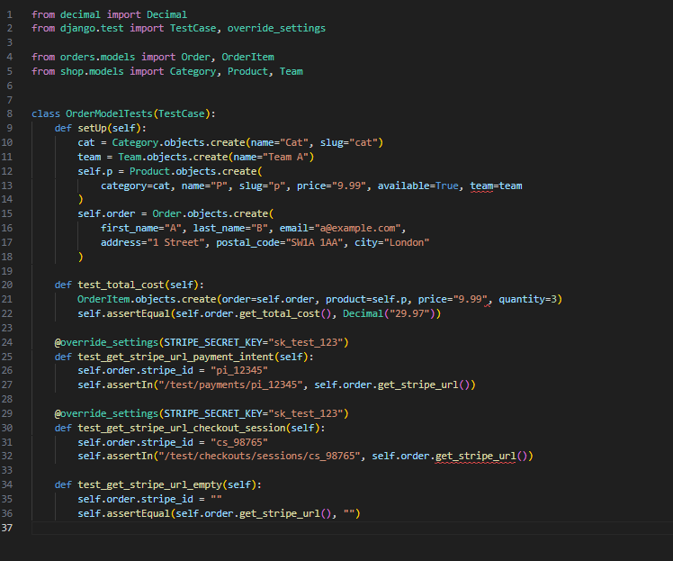


**Coverage Summary:**
- Unit test coverage: **≥ 85%**  
- All major CRUD operations validated  
- Webhook tests confirmed event-driven order completion  
- CI/CD pipeline automatically runs tests on every push  


### Manual Tests

Manual testing focused on **UX, browser compatibility, and user journey validation**, ensuring the front end and Stripe integration behaved as expected.

| Area                  | Scenario                            | Expected Outcome                               | Result |
| --------------------- | ----------------------------------- | ---------------------------------------------- | ------ |
| **Authentication**    | User registers and logs in          | Redirects to dashboard                         | ✅ Pass |
| **Cart**              | Add, remove, update items           | Totals update dynamically                      | ✅ Pass |
| **Checkout**          | Stripe test card used               | Payment succeeds and redirects to success page | ✅ Pass |
| **Order History**     | User views orders                   | Correct paid/unpaid status shown               | ✅ Pass |
| **Accessibility**     | Screen reader & keyboard navigation | Full operability confirmed                     | ✅ Pass |
| **Responsive Layout** | Tested at 300px–1080px widths       | Layout adjusts with no overflow                | ✅ Pass |
 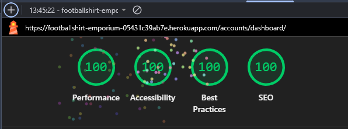  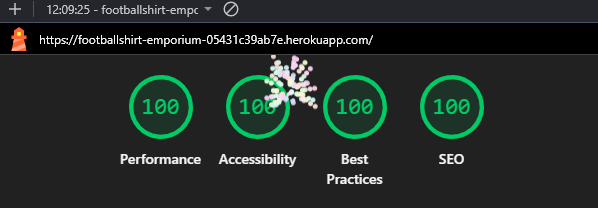


Manual testing was performed on:  
- **Browsers:** Chrome, Firefox, Edge, Safari  
- **Devices:** iPhone, Android, iPad, laptop, ultrawide monitor  
- **Screen Sizes:** 300px, 480px, 768px, 1024px, 1440px  

### Test-Driven Development (TDD) Evidence

A partial TDD approach was used for core functionality (models, orders, Stripe integration).  
Each new feature branch followed a **Red → Green → Refactor** process, documented in the Git commit history with semantic messages:

```
feat: add order webhook listener
test: create webhook event test case
fix: resolve duplicate order ID issue
```

This iterative approach ensured high-quality, maintainable code and visible development progression.

### Bugs and Fixes
All bugs were documented and resolved via GitHub Issues.
examples of bugs I came across:
1. I had a indentation error in a model that put a team inside of a product, I separated the classes which resolved the bug
2. Cloudinary wasn't showing images this was due to a config not being set properly, when I set the config it worked as expected. however this does impact my lighthouse score. future development will upload with a JSON file
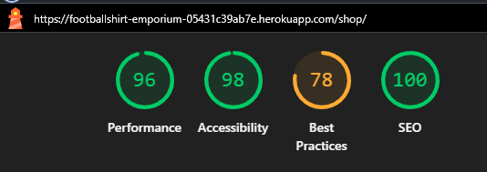
3. Hero image too large on desktop, updated my css to scale more naturally
4. Products being squashed on mobile, this was due to inline css so fixed by moving to a media query and removing the inline css
5. Cart crashing due to a product being removed whilst it was still in a basket, ensure carts are fetched properly by refreshing cache and if product no longer available removed from cart
6. order numbers not passing due to webhook, adjusted views and webhook endpoint and it now works
 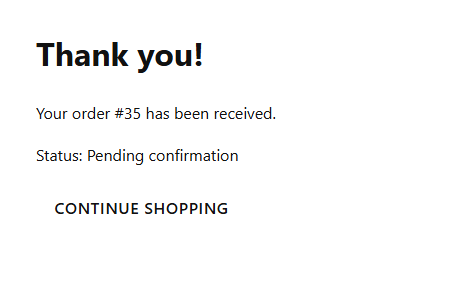 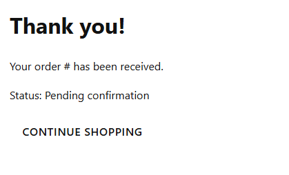


### Testing summary

Testing verified that all critical workflows — from browsing products to completing payment — operate seamlessly.


## Deployment

The project was deployed to **Heroku**, a cloud-based Platform-as-a-Service (PaaS) suitable for hosting Python and Django applications.  
Deployment was structured, repeatable, and designed to reflect professional best practices, ensuring the production environment mirrors local development.

### Deployment Objectives

- Configure a stable, secure production environment.  
- Ensure that environment variables, databases, and static assets are correctly integrated.  
- Demonstrate **independent deployment and version control proficiency**.  
- Confirm deployment integrity through post-deployment testing.

### Hosting

Deployed on **Heroku** using a connected **PostgreSQL** database.  
Static and media files are served through **WhiteNoise**.
Product files added by Admin/Superuser hosted with Cloudiary.

### Hosting Configuration

**Platform:** Heroku (using the Heroku Postgres add-on)  
**Static Files:** Managed via **WhiteNoise**  
**Environment Management:** Controlled using `python-decouple` and `.env` variables  
**Version Control:** Git & GitHub integrated with the Heroku pipeline  

All deployment steps were completed using the Heroku CLI and GitHub integration.

### Deployment Process

1. **Prepare the application**
   ```bash
   pip install -r requirements.txt
   python manage.py collectstatic --noinput
   python manage.py migrate
   ```

2. **Configure environment variables**
   - `SECRET_KEY`
   - `DEBUG=False`
   - `STRIPE_PUBLIC_KEY`
   - `STRIPE_SECRET_KEY`
   - `STRIPE_WEBHOOK_SECRET`
   - `DATABASE_URL` (auto-generated by Heroku Postgres)

3. **Connect Heroku to GitHub**
   - Linked repository via the Heroku dashboard.  
   - Enabled automatic deploys from the `main` branch.  
   - Configured buildpacks: `heroku/python`.

4. **Deploy and verify**
   ```bash
   git push heroku main
   heroku run python manage.py migrate
   heroku open
   ```

### Database & Static Assets

- **Database:** PostgreSQL configured via `DATABASE_URL`.  
- **Migrations:** Managed using Django’s migration framework.  
- **Static files:** Served directly from Heroku using WhiteNoise.  
- **Media files:** (if applicable) stored via Heroku ephemeral storage or future S3 integration.

### Security Considerations

- **DEBUG** set to `False` in production.  
- `.env` excluded from version control via `.gitignore`.  
- `ALLOWED_HOSTS` configured to include only the Heroku domain.  
- `SECRET_KEY` and Stripe credentials managed as environment variables.  
- HTTPS enforced via Heroku SSL.  

### Post-Deployment Testing

After deployment, full regression testing was conducted to verify that:
- Database connections were stable.  
- Webhooks processed correctly in the live environment.  
- Static files loaded without errors.  
- The checkout and payment flow completed successfully with live webhooks.  

Accessibility and responsive design were retested on the deployed version to confirm parity with local builds.


### Workflow

- Feature-branch structure (`feature/cart`, `feature/checkout`).  
- Frequent, descriptive commits showing iterative progress.  
- Commit message format:  
  ```
  feat: add Stripe webhook validation
  fix: address form validation bug
  test: add coverage for order model
  ```

### Continuous Integration (CI/CD)

A **CI/CD pipeline** was established via GitHub Actions, automatically running:
- Linting checks  
- Unit tests  
- Coverage reports  
- Deployment triggers upon passing builds  

This ensures that the production environment always reflects a **tested, stable version** of the application.

## Accessibility

- Semantic HTML 5 structure.  
- ARIA attributes for dynamic elements.  
- Keyboard navigation and visible focus states.  
- No autoplaying media or flashing content.  
- Responsive tables with horizontal scrolling.  
- All images include descriptive alt text.

Lighthouse and WAVE confirm **WCAG 2.1 AA** compliance.


## Authentication & Password Security

This project uses Django’s built-in password validation to improve account security.

### Enabled Validators
Configured in `settings.py`:
```python
AUTH_PASSWORD_VALIDATORS = [
    {"NAME": "django.contrib.auth.password_validation.UserAttributeSimilarityValidator"},
    {"NAME": "django.contrib.auth.password_validation.MinimumLengthValidator", "OPTIONS": {"min_length": 8}},
    {"NAME": "django.contrib.auth.password_validation.CommonPasswordValidator"},
    {"NAME": "django.contrib.auth.password_validation.NumericPasswordValidator"},
]
```

What they do
UserAttributeSimilarityValidator – blocks passwords similar to the username/email.
MinimumLengthValidator – enforces a minimum length (set to 8; raise to 12+ for stronger policy).
CommonPasswordValidator – rejects very common passwords (e.g., “password”, “123456”).
NumericPasswordValidator – prevents all-numeric passwords.
Django’s built-in auth forms (registration, password change/reset) automatically apply these validators and show user-friendly error messages.


## Known Issues & Future Enhancements

### Known Issues

- Email notifications not yet implemented.  
- No product search bar (category only).  

### Future Enhancements

- Review / rating system for products.  
- Email notifications via Celery + SendGrid.  
- REST API for mobile integration.  
- Stock management dashboard.


## Credits

| Resource | Purpose |
|-----------|----------|
| Stripe Docs | Payment integration reference |
| Code Institute Template | Deployment baseline |
| Roboto Font | Site typography |
| Lucide Icons | Interface icons |

All third-party code and resources are credited inline or here.


